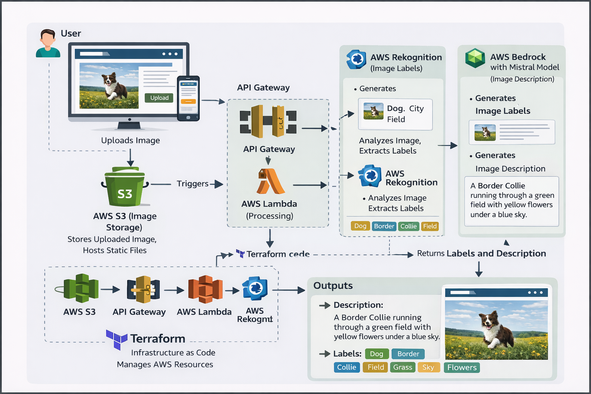

<div align="center">

# 🔍 VISIO — AI-Powered Image Analyzer

[](https://aws.amazon.com)
[](https://terraform.io)
[](https://python.org)
[](https://aws.amazon.com/lambda/)
[](https://aws.amazon.com/rekognition/)
[](LICENSE)

<br/>

> Upload any image — get **AI-detected object labels** from Amazon Rekognition and  
> a **natural-language scene description** from Amazon Bedrock (Mistral Small),  
> all deployed in under 5 minutes with a single `terraform apply`.

<br/>



</div>

---

## ✨ Features

| Capability | AWS Service | Detail |
|---|---|---|
| 🏷️  Object & scene detection | Amazon Rekognition | Up to 10 labels, ≥ 80 % confidence |
| 🤖  Natural-language description | Amazon Bedrock — Mistral Small | Single sentence, temperature 0.5 |
| ⚡  Serverless compute | AWS Lambda (Python 3.9) | 30 s timeout, zero cold-start cost at demo scale |
| 🔌  REST API | Amazon API Gateway | POST `/analyze`, CORS-enabled for browser use |
| 🌐  Static website hosting | Amazon S3 | Publicly accessible, versioned, zero-ops |
| 🏗️  Infrastructure as code | Terraform ≥ 1.5 | Reproducible, git-versionable, one-command teardown |

---

## 🏗️ Architecture

```
┌─────────────────────────────────────────────────────────────────┐
│                        Browser (VISIO UI)                        │
│              index.html  hosted on  Amazon S3                   │
└─────────────────────────┬───────────────────────────────────────┘
                          │  POST /analyze
                          │  { "image": "<base64>" }
                          ▼
              ┌───────────────────────┐
              │   Amazon API Gateway  │  REST API — stage: v1
              │   /analyze  POST      │
              └───────────┬───────────┘
                          │  AWS_PROXY integration
                          ▼
              ┌───────────────────────┐
              │     AWS Lambda        │  Python 3.9 · 30 s timeout
              │  image_analyzer.py    │
              └──────┬────────────────┘
                     │                    │
          DetectLabels                InvokeModel
                     │                    │
                     ▼                    ▼
         ┌─────────────────┐   ┌──────────────────────┐
         │Amazon Rekognition│   │   Amazon Bedrock      │
         │  (labels list)   │   │  Mistral Small        │
         └─────────────────┘   │  (description text)   │
                               └──────────────────────┘
                          │
                          ▼
          JSON: { "labels": [...], "description": "..." }
```

**Data flow in 4 steps:**
1. User selects an image in the browser → JS encodes it to base-64
2. Browser POSTs the payload to API Gateway → Lambda is invoked
3. Lambda calls Rekognition (labels) **and** Bedrock (description) in sequence
4. Lambda returns JSON → UI renders animated label tags + AI description

---

## 📁 Project Structure

```
ai-image-analyzer/
│
├── 📄  README.md                         ← you are here
│
├── 🖼️  ARCHITECTURE/
│   └── Architecture.png                  ← visual system diagram
│
├── 💻  CODE/
│   │
│   ├── frontend/
│   │   └── index.html                    ← VISIO single-page app (HTML/CSS/JS)
│   │
│   ├── lambda/
│   │   └── image_analyzer.py             ← AWS Lambda handler (boto3)
│   │
│   └── terraform/
│       ├── main.tf                       ← all AWS resource definitions
│       ├── variables.tf                  ← configurable input variables
│       ├── outputs.tf                    ← exported post-deploy values
│       └── image_analyzer.zip            ← Lambda deployment package (auto-generated)
│
└── 📦  OUTPUT/
    └── README.md                         ← copy for CI/CD pipelines
```

---

## 🚦 Prerequisites

Before you begin, make sure the following are available:

| Tool | Minimum Version | Install Guide |
|---|---|---|
| AWS Account | Free tier | https://aws.amazon.com/free |
| Terraform | ≥ 1.5.0 | https://developer.hashicorp.com/terraform/install |
| AWS CLI | ≥ 2.0 | https://docs.aws.amazon.com/cli/latest/userguide/install-cliv2.html |
| Python | ≥ 3.8 | https://python.org (only for local use) |

> **No prior AWS or Terraform experience is required.**  
> The Colab notebook (`AI_Powered_Image_Analyzer.ipynb`) guides you through every step interactively.

---

## ⚡ Quick-Start Deployment

### Option A — Colab (Recommended for Beginners)

1. Upload `AI_Powered_Image_Analyzer.ipynb` to [Google Colab](https://colab.research.google.com)
2. Follow **Sections 8–12** (Deployment Guide inside the notebook)
3. Open the printed website URL when Section 12 completes

### Option B — Local Terminal

```bash
# 1. Enter the Terraform directory
cd ai-image-analyzer/CODE/terraform

# 2. Initialise provider plugins
terraform init

# 3. Review what will be created (14 resources)
terraform plan

# 4. Deploy to AWS  (~90 seconds)
terraform apply -auto-approve

# 5. Patch API URL into the frontend
#    (replace <URL> with the api_gateway_url Terraform printed)
sed -i "s|https://oest2wm8g3.execute-api.*analyze|<URL>/analyze|" ../frontend/index.html

# 6. Upload the frontend
aws s3 cp ../frontend/index.html s3://$(terraform output -raw frontend_bucket_name)/index.html \
    --content-type text/html

# 7. Open the app
echo "http://$(terraform output -raw frontend_website_endpoint)"
```

---

## 🔧 Configuration

Edit `CODE/terraform/variables.tf` to customise the deployment:

```hcl
variable "aws_region" {
  default = "us-east-1"   # change to your nearest region
}

variable "project_name" {
  default = "ai-image-analyzer"   # prefix for all resource names
}

variable "environment" {
  default = "dev"   # dev | staging | prod
}
```

Alternatively, override at the command line:

```bash
terraform apply -var="aws_region=eu-west-1" -var="project_name=visio-prod"
```

---

## 🔒 Security Posture

| Area | Current (Demo) | Recommended (Production) |
|---|---|---|
| API Auth | None (public POST) | Cognito User Pool Authorizer |
| CORS | Wildcard `*` | Restrict to your S3 website domain |
| IAM | Scoped to 3 actions | No changes needed |
| S3 | Public read (static site) | CloudFront + OAC |
| Secrets | No secrets in code | AWS Secrets Manager if keys needed |

---

## 💰 Cost Estimate (AWS Free Tier)

| Service | Free-Tier Allowance | At 100 Requests/Month |
|---|---|---|
| Lambda | 1 M requests / month | **$0.00** |
| Rekognition | 5 000 images / month *(first 12 mo)* | **$0.00** |
| Bedrock — Mistral Small | ~$0.0002 per 1 K input tokens | **≈ $0.002** |
| API Gateway | 1 M calls / month *(first 12 mo)* | **$0.00** |
| S3 | 5 GB storage, 20 K GET | **$0.00** |

> **Total demo cost ≈ $0.00 – $0.01 / month.**  
> Run `terraform destroy` when finished to eliminate all ongoing charges.

---

## 🗑️ Teardown

```bash
cd ai-image-analyzer/CODE/terraform
terraform destroy -auto-approve
```

Terraform empties and deletes the S3 bucket, removes the Lambda function, API Gateway, and all IAM resources in a single command (~60 seconds).

---

## 🤝 Contributing

Contributions are welcome!

1. Fork the repository
2. Create a feature branch: `git checkout -b feature/my-improvement`
3. Commit your changes: `git commit -m 'Add feature'`
4. Push and open a Pull Request

Please open an issue first for major changes.

---

## 📄 License

This project is licensed under the **MIT License**.  
See [LICENSE](LICENSE) for full terms.

---

<div align="center">

**Built with ❤️ using Amazon Rekognition · Amazon Bedrock · AWS Lambda · Terraform**

</div>
